# Deckard
Deckard is a Unity-based layout tool for card game prototyping, built for game designers who are already familiar with Unity's built-in Canvas components.

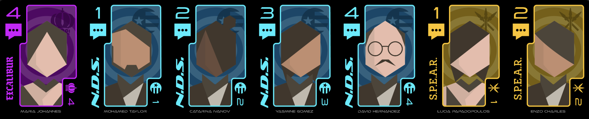

There are lots of great existing tools for generating card assets, including [nanDECK](https://www.nandeck.com/), [Component Studio](https://component.studio/), [Squib](https://github.com/andymeneely/squib), [Cocktail](https://cocktail.software/download/), [CardMaker](https://github.com/nhmkdev/cardmaker), and [InDesign data merge](https://helpx.adobe.com/indesign/using/data-merge.html), but if you are most comfortable building out layouts in Unity, you might want to give Deckard a try!

Deckard is designed to be used as an editor tool only, and is not optimized or designed for use in builds or runtime gameplay.

## Features
* Combine card data from CSVs with Unity UI prefabs to generate decks of cards
* Customize text, images, colors, and more while using intuitive human-readable names in your spreadsheets
* Export cards as individual files, print-and-play sheets, and sprite atlases for digital prototyping platforms (Screentop.gg, Tabletop Playground, etc.)

## Installation
We recommend you install Deckard via [OpenUPM](https://openupm.com/packages/com.jonagill.deckard/). Per OpenUPM's documentation:

1. Open `Edit/Project Settings/Package Manager`
2. Add a new Scoped Registry (or edit the existing OpenUPM entry) to read:
    * Name: `package.openupm.com`
    * URL: `https://package.openupm.com`
    * Scope(s): `com.jonagill.deckard`
3. Click Save (or Apply)
4. Open Window/Package Manager
5. Click the + button
6. Select Add package by name...
6. Click Add

## Core assets
To generate a deck, you will want to create the following assets:

#### CSV data
A CSV file generated from a spreadsheet will provide the raw data for customizing all the cards of your deck. This CSV can be exported from any existing spreadsheet in a tool like Google Sheets or Excel.

The top row of your spreadsheet will be treated as headers and define the name of each column.

Every other row of your spreadsheet will define a single card in your deck, defining details like its text, images, colors, resource counts, and so on. Feel free to use whatever names you want for images and colors -- you'll give these names meaning later in Unity.

If you want to include multiple copies of each card in your deck, you can create a column titled Count to define the number of copies of each card in your deck.

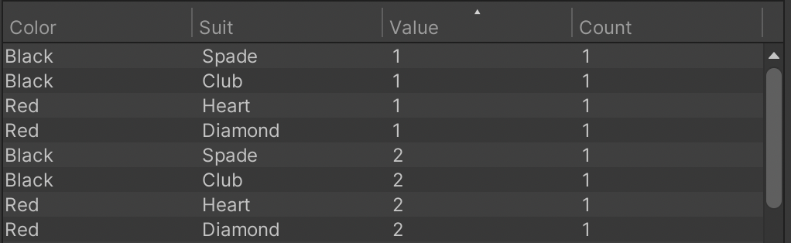

#### DeckAsset
DeckAssets are ScriptableObject assets that define a deck of cards. They link together a CSV file and a corresponding DeckardCanvas prefab, and their inspector provides access to Deckard's various export options.

Hover over each property in the inspector to learn more about what it does.

You can create a DeckAsset via the right-click `Create > Deckard > New Deck` context menu item.

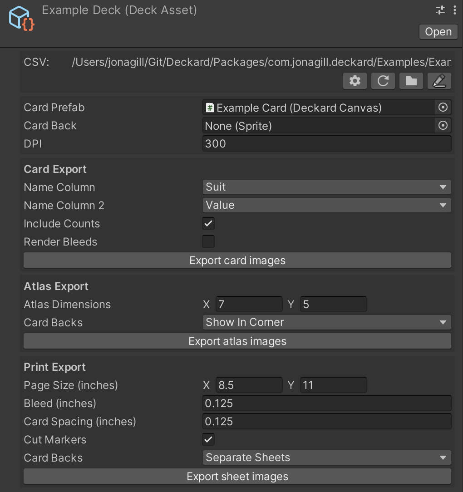

#### DeckardCanvas prefab
DeckardCanvases are components that go on a Unity prefab to define a card's layout. You can then use Unity's regular set of RectTransform and layout options to design your card's layout.

To create a new DeckardCanvas, create a new GameObject, add the DeckardCanvas component to it, and then save it as a prefab.

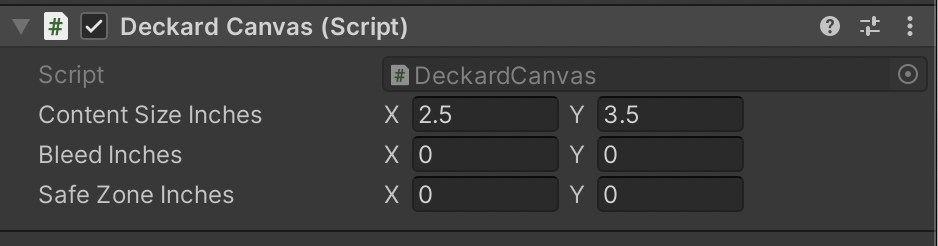

#### SpriteCollection
SpriteCollections are ScriptableObject assets that define a set of sprites. Each sprite is assigned a human-readable key so that you can easily reference it from your spreadsheets.

The "Bulk Import from Folder" option allows you to rapidly add all of the sprites in a folder into the SpriteCollection, using their filenames as the default keys.

You can create a SpriteCollection via the right-click `Create > Deckard > New SpriteCollection` context menu item.

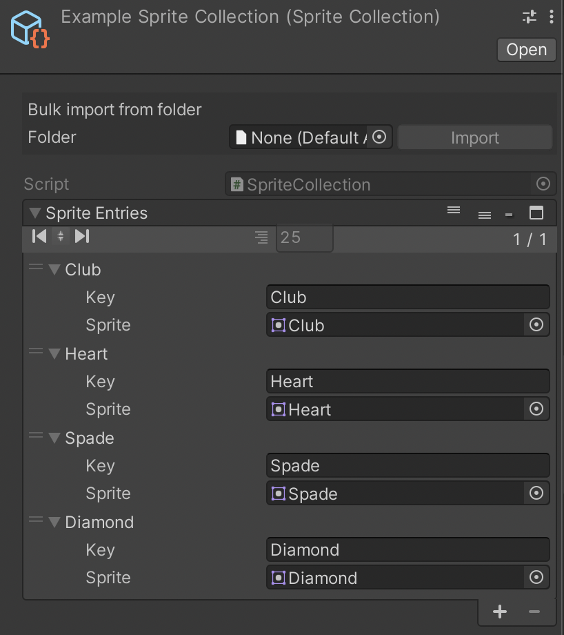

#### ColorCollection
SpriteCollections are ScriptableObject assets that define a set of colors. Each color is assigned a human-readable key so that you can easily reference it from your spreadsheets.

You can create a ColorCollection via the right-click `Create > Deckard > New ColorCollection` context menu item.

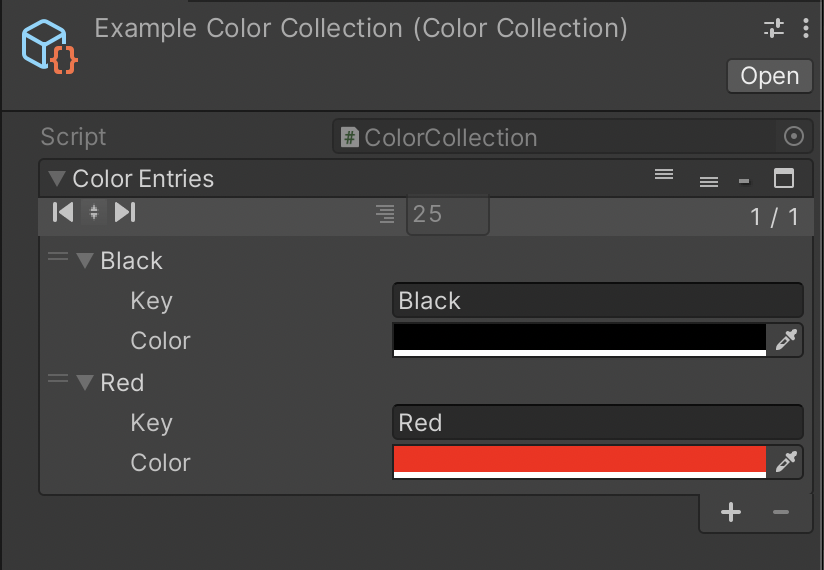

## Decorator components
Deckard provides a suite of components that can be placed on your card prefabs to customize each card during the export process.

### CSV data components
These components read in fields from your spreadsheet CSV and modify the cards using that data.

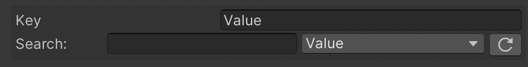

For every CSV data component, you will have to specify the name of the column that this component will reference when running its logic. A search field and drop-down box are provided to help you find the valid names of the columns in all of your decks.

#### CsvSprite
This component will assign a sprite to an Image component on the same GameObject based on the contents of a CSV field. You must assign a reference to the SpriteCollection that you want to use for this object.

If no sprite can be found in the SpriteCollection matching the name in the CSV field, the Image will be disabled and hidden in any exports. This means that the Image will be hidden appropriately for empty fields in your CSV.

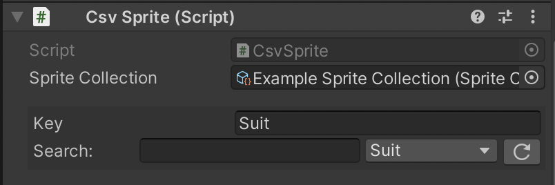

#### CsvText
This component copies the contents of a CSV field into a TextMeshProUGUI text component on the same GameObject.

If your TextMeshProUGUI component has rich text enabled, you can use [rich text tags](http://digitalnativestudios.com/textmeshpro/docs/rich-text/) to stylize your text.

By assigning a reference to a SpriteCollection asset, you can embed icon sprites within your text by surrounding the name of a sprite in that collection with double carats, such as: `<<spritename>>`. By default, embedded sprites will be tinted to match the color of the surrounding text. To render an icon without colorization, add an exclamation point to the start of it's name like so: `<<!spritename>>`.

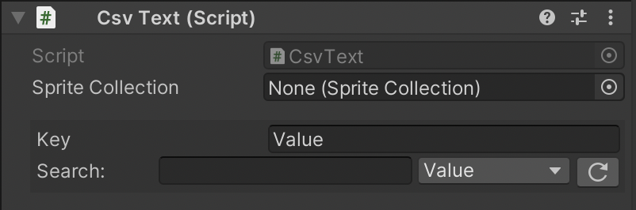

#### CsvColor
This component colorizes Graphic components (TextMeshProUGUI, Image, etc.) on the same object based on the contents of a CSV field. You must assign a reference to the ColorCollection that you want to use for this object.

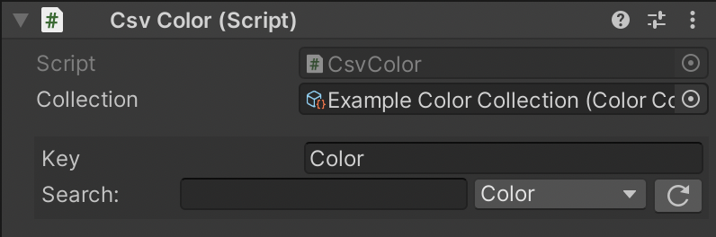

#### CsvCount
This component will duplicate the GameObject that it's on to match the number of instances specified in a CSV field. This is useful for things like mana costs or health values where you want a variable number of icons based on a certain value on the card.

You will generally want to make sure that any GameObjects containing a CsvCount component are children of a HorizontalLayoutGroup, VerticalLayoutGroup, or GridLayoutGroup so that they can be dynamically positioned correctly based on the number of instances generated.

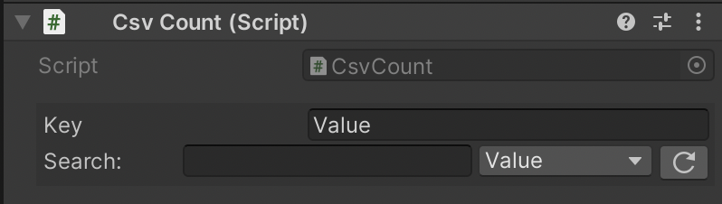

#### CsvVisibility
This component will enable and disable a GameObject (and all of its children) by comparing a value in a CSV field with the conditions and values specified on the component.

If multiple conditions are specified, you can choose whether a single condition being true will make the GameObject visible, or require that all conditions be true before the GameObject is made visible.

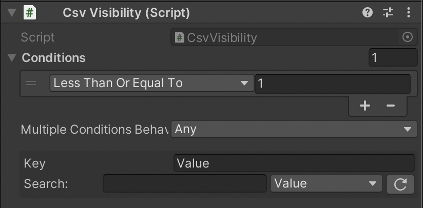

### Export type components
These components will alter their behavior based on the export settings you are using.

#### EnableForBleed
This component will enable or disable the targeted components based on whether the current export contains the bleed region of the cards or not.

Bleeds are always included for printable sheet exports, never included for sprite atlas exports, and can optionally be included when exporting individual card images.

Note that unlike CsvVisibility, this component will enable and disable specific components, rather than entire GameObjects. This means you can use it to target specific components to disable without altering the overall layout of your card.

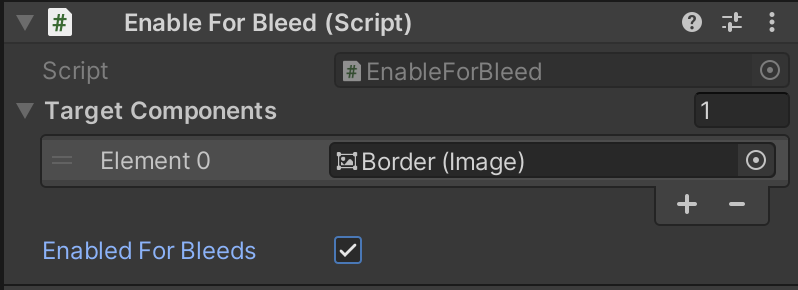

#### EnableForExportType
This component will enable or disable the targeted components based on whether you are exporting individual card images or whole sheets of cards (printable sheets or sprite atlases).

This is mainly useful for enabling and disabling background elements that you want opaque when exporting sheets, but transparent when exporting individual cards (such as the exterior region of circular tokens).

Note that unlike CsvVisibility, this component will enable and disable specific components, rather than entire GameObjects. This means you can use it to target specific components to disable without altering the overall layout of your card.

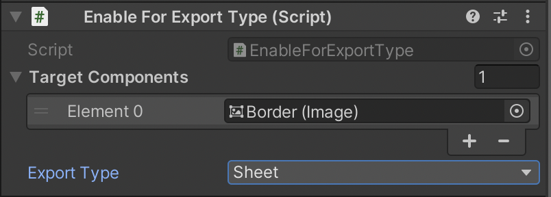

## Bonus content
#### TextureImporter.preset
A Unity preset that specifies some desirable default values for importing textures as Deckard-ready Sprites.

## Tips & tricks
#### Import icons as 100% white
Unless you have full color art for your icons, you should export your icons from your art program as completely white (apart from any transparency). This will allow you to dynamically tint your icons however you want using Unity's Image component and Deckard's CsvColor component.

#### Use Unity's Vector Graphics package to import SVGs
Vector graphics can be a great way to author icons, as they maintain their quality at any resolution. They can also be easily downloaded from website like [The Noun Project](https://thenounproject.com/) and [GameIcons.net](https://game-icons.net/). Unity does not support importing SVGs by default, but there is a first-party package that allows you to import SVGs and automatically convert them into Image-compatible sprites.

Unfortunately, this package is marked as experimental and is hidden in Unity's Package Manager by default. On pre-2020 versions of Unity, you could just tick a box to get Experimental packages to show up in the Package Manager. Starting with Unity 2020, [Unity has started hiding experimental packages entirely](https://forum.unity.com/threads/visibility-changes-for-preview-packages-in-2020-1.910880/) unless you know the exact package name to import.

To install the Unity Vector Graphics package, open the Package Manager (`Window > Package Manager`), hit the plus icon, and select "Add package by name". Paste in `com.unity.vectorgraphics` into the window that pops up, hit Add, and Unity should download the latest version of the package to include in your project.

#### Ignore EndLayoutGroup errors
There seems to be a bug in how Unity's layout scopes work for editor UI, such that every time you export, Unity will print an error saying `EndLayoutGroup: BeginLayoutGroup must be called first.`. This is totally benign and is safe to ignore.
